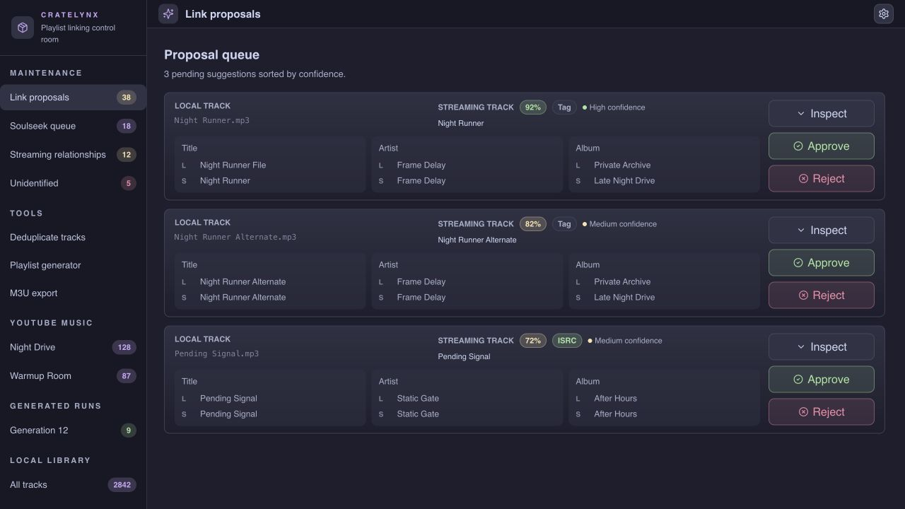
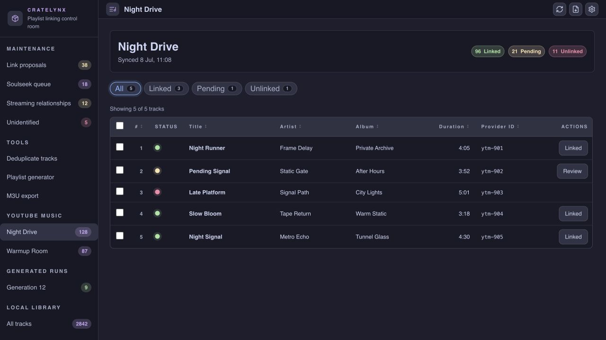

# crate-lynx

A personal music-library control room for people who want streaming playlists to
drive a local file collection.

Crate Lynx mirrors YouTube Music playlist metadata, imports and fingerprints
local audio, proposes matches between streaming tracks and local files, and
exports playlist-shaped M3U files backed by the local library. It is built for a
single trusted operator on a private machine or LAN, not as a hosted multi-user
service.

## Screenshots

The screenshots below use synthetic demo data.





## What it does

- Syncs YouTube Music playlist metadata into a local Postgres database.
- Watches ingest folders, transcodes/imports audio with FFmpeg and Beets, and
  keeps processed files under a stable library root.
- Generates link proposals using ISRC and fuzzy artist/title/album matching.
- Keeps final link approval manual, with reject/re-match workflows for cleanup.
- Resolves equivalent streaming-track relationships so duplicate streaming
  entries can share one local file.
- Searches and queues missing tracks through an optional slskd/Soulseek
  integration.
- Generates M3U/M3U8 and Rekordbox XML exports from linked streaming playlists
  and generated local playlists.
- Builds sonic playlist trees from local audio features for crate-digging and
  library exploration.

---

## Architecture

| Service | Stack |
|---|---|
| `app` | Python 3.12.13, FastAPI, RQ worker, Beets, FFmpeg, Chromaprint |
| `app-ui` | React (Vite), TypeScript, Tailwind CSS + Catppuccin Mocha, TanStack Query |
| `db` | PostgreSQL 16+ |
| `redis` | Message broker for RQ background jobs |

The `app` container runs the FastAPI server (`uvicorn`) plus dedicated RQ workers: one ingestion worker by default, one worker for matching/streaming/Soulseek jobs, and two sonic feature workers. They share the same codebase and environment config.

---

## Getting started

Prerequisites: Docker Engine with the Compose v2 plugin, enough disk space for
Postgres/Redis and the local library, and writable host directories for the two
bind mounts. `openssl` is useful for generating the database password; Python
with `cryptography` is used below to generate the Fernet key.

```bash
cp .env.example .env
# Generate TOKEN_ENCRYPTION_KEY and add it to .env:
python -c 'from cryptography.fernet import Fernet; print(Fernet.generate_key().decode())'
# Generate POSTGRES_PASSWORD and add it to .env:
openssl rand -base64 32

# Create the default bind-mount layout, or change both host paths in .env first.
sudo mkdir -p \
  /mnt/nas_data/cratelynx/{music-in,staging,dedupe-quarantine} \
  /mnt/nas_data/soulseek/downloads \
  /mnt/nas_data/media/music \
  /docker/appdata/cratelynx/{app,postgres,redis}

docker network inspect music >/dev/null 2>&1 || docker network create music
docker compose config >/dev/null
docker compose run --build --rm config-preflight
docker compose up --build
```

For local backend development, use Python 3.12.13. A repo-level `.python-version` file is included for tools such as `pyenv`.

The UI is served at `http://localhost:18100` (Nginx). The API is available at `http://localhost:18101` and proxied through the UI at `http://localhost:18100/api`. The Compose file also joins an external Docker network named `music` for optional slskd integration; create it once before first startup if it does not already exist.

The one-shot `config-preflight` service runs automatically before `app`. It
validates required secrets, bounded worker and Soulseek settings, optional
slskd configuration completeness, and the existence/writeability of mounted
container paths. It does not connect to or mutate Postgres, Redis, slskd, or
the music library.

---

## Deployment

This is a personal/LAN-oriented app, not a hardened multi-user hosted service. Deploy it on a trusted machine or private Docker host, put it behind your own reverse proxy if needed, and avoid exposing the API, Postgres, or Redis directly to the public internet.

Deploy with Docker Compose from a checkout that has a populated `.env` file:

```bash
docker compose up --build -d
```

Published ports bind to `127.0.0.1` by default. If you deliberately want LAN access without a reverse proxy, set the relevant `*_BIND_HOST` values in `.env` to a trusted interface such as `0.0.0.0`, then make sure host firewall rules match that choice.

To verify the deploy, check that all containers are healthy:

```bash
docker compose ps
```

The Compose stack creates a fixed-name Docker network, `cratelynx`, and attaches only `app-ui` to it for optional Traefik routing. Set `CRATELYNX_HOST` in `.env` to the hostname your reverse proxy should serve. Traefik should join that network as an external network:

```yaml
services:
  traefik:
    networks:
      - cratelynx

networks:
  cratelynx:
    external: true
```

Backend services (`app`, `db`, and `redis`) stay on the internal Compose network. The browser calls `/api/...` on the same origin, and Nginx in `app-ui` proxies those requests to FastAPI internally.

---

## Environment variables

| Variable | Purpose |
|---|---|
| `TOKEN_ENCRYPTION_KEY` | Fernet key for encrypting streaming auth tokens. Generate one with `python -c 'from cryptography.fernet import Fernet; print(Fernet.generate_key().decode())'` |
| `POSTGRES_DB` / `POSTGRES_USER` / `POSTGRES_PASSWORD` | Database bootstrap credentials. `POSTGRES_PASSWORD` has no default and must be set |
| `CRATELYNX_HOST` | Optional hostname used by the Traefik labels. Defaults to `cratelynx.local` |
| `UI_BIND_HOST` / `APP_BIND_HOST` / `DB_BIND_HOST` / `REDIS_BIND_HOST` | Host interface for published Compose ports. Defaults to `127.0.0.1`; use wider binds only on a trusted LAN |
| `LIBRARY_ROOT` | Container path where processed music is stored. Defaults to `/nas/media/music` |
| `LOCAL_DEDUPE_QUARANTINE_ROOT` | Container path where deduplicated local files are moved. Defaults to `/nas/cratelynx/dedupe-quarantine` |
| `BEETS_LIBRARY` | Container path for the Beets SQLite database. Defaults to `/data/beets/library.db` |
| `BEETS_IMPORT_LOCK_PATH` | Optional path for the cross-process Beets import lock. Defaults next to `BEETS_LIBRARY` |
| `CRATE_LYNX_STAGING_DIR` | Container base path for temporary app outputs. Defaults to `/nas/cratelynx/staging` in Compose |
| `INGESTION_STABILITY_WORKERS` | Concurrent watcher stability checks. Defaults to `4`; valid range `1`–`64` |
| `INGESTION_WORKER_COUNT` | RQ workers listening to the ingestion queue. Defaults to `1`; valid range `1`–`32` |
| `SONIC_WORKER_COUNT` | Dedicated RQ workers listening to the sonic queue. Defaults to `2`; valid range `1`–`32` |
| `SLSKD_BASE_URL` | Base URL for the slskd HTTP API. Required for Soulseek search/download actions |
| `SLSKD_API_KEY` | slskd API key sent as `X-API-Key`. Required for Soulseek search/download actions |
| `SLSKD_VERIFY_SSL` | Whether to verify slskd HTTPS certificates. Defaults to `true` |
| `SLSKD_REQUEST_TIMEOUT_SECONDS` | Per-request HTTP timeout. Defaults to `10`; valid range `0.1`–`120` |
| `SLSKD_SEARCH_TIMEOUT_SECONDS` | slskd search lifetime. Defaults to `30`; valid range `1`–`3600` |
| `SLSKD_SEARCH_POLL_TIMEOUT_SECONDS` | Maximum time to poll search responses. Defaults to `30`; valid range `0.1`–`3600` |
| `SLSKD_SEARCH_POLL_INTERVAL_SECONDS` | Delay between search polls. Defaults to `2`; valid range `0.05`–`300` and cannot exceed the poll timeout |
| `SLSKD_RESPONSE_LIMIT` | Maximum search responses considered. Defaults to `100`; valid range `1`–`10000` |
| `SLSKD_FILE_LIMIT` | Maximum files considered across responses. Defaults to `10000`; valid range `1`–`1000000` |
| `SLSKD_MAXIMUM_PEER_QUEUE_LENGTH` | Reject candidates above this peer queue length. Defaults to `1000000`; valid range `0`–`10000000` |
| `SLSKD_MINIMUM_PEER_UPLOAD_SPEED` | Reject peers below this upload speed in bytes/second. Defaults to `0`; valid range `0`–`1000000000` |
| `SLSKD_WEBHOOK_TOKEN` | Shared token required by the internal slskd download-complete webhook |
| `SLSKD_DOWNLOADS_CONTAINER_ROOT` | slskd container download root reported in webhook payloads. Defaults to `/data/soulseek/downloads` |
| `SLSKD_DOWNLOADS_APP_ROOT` | CrateLynx app container path for the same downloads. Defaults to `/nas/soulseek/downloads` |

Compose attaches the backend app container to the external `music` Docker network so `SLSKD_BASE_URL=http://slskd:5030` can reach an existing slskd container when you run one on that network.
Configure slskd to send `DownloadFileComplete` webhooks to `http://crate-lynx-app-1:8000/api/soulseek/slskd/download-complete` on the shared Docker network with header `X-CrateLynx-Webhook-Token: <SLSKD_WEBHOOK_TOKEN>`.

## Storage and mounts

Docker Compose reads host paths from `.env`, with Linux host-path defaults that are meant to be edited for your machine:

| Env var | Default host path | Container path | Purpose |
|---|---|---|
| `NAS_DATA_HOST_PATH` | `/mnt/nas_data` | `/nas` | NAS root containing ingest inputs, staging, Soulseek downloads, and processed music |
| `APP_DATA_HOST_PATH` | `/docker/appdata/cratelynx` | service-specific paths | Application-owned state for the app, Postgres, and Redis |

Create those host directories before starting the stack, or override the host path variables in `.env`. They must be writable by containers; permissions and ownership are host-specific. The paths configured in Settings are container paths, so any useful ingest folder should also be mounted into the `app` container.

`/nas/media/music` is output only. Do not add it as an ingest folder, because completed imports are moved there and watching it would re-ingest files that Beets has already processed.

For same-filesystem moves and MP3 hardlinks, keep ingest inputs, staging, and the final music library under `NAS_DATA_HOST_PATH`. One workable layout is:

| Host path | Container path | Purpose |
|---|---|---|
| `/mnt/nas_data/cratelynx/music-in` | `/nas/cratelynx/music-in` | Default manual ingest input |
| `/mnt/nas_data/soulseek/downloads` | `/nas/soulseek/downloads` | Default Soulseek download ingest input |
| `/mnt/nas_data/cratelynx/staging` | `/nas/cratelynx/staging` | Temporary ingestion staging |
| `/mnt/nas_data/cratelynx/dedupe-quarantine` | `/nas/cratelynx/dedupe-quarantine` | Quarantined duplicate local files |
| `/mnt/nas_data/media/music` | `/nas/media/music` | Processed library output managed by Beets |

Application state is stored under `APP_DATA_HOST_PATH`:

| Host path | Container path | Purpose |
|---|---|---|
| `/docker/appdata/cratelynx/app` | `/data` in `app` | Beets SQLite database and application state |
| `/docker/appdata/cratelynx/postgres` | `/var/lib/postgresql/data` in `db` | Postgres data directory |
| `/docker/appdata/cratelynx/redis` | `/data` in `redis` | Redis data directory |

---

## Development

### Backend (`app/`)

```bash
python3.12 -m venv .venv
source .venv/bin/activate
pip install -r app/requirements.txt -r requirements-dev.txt
ruff check .          # lint
ruff format .         # format
pytest                # tests
```

### Frontend (`app-ui/`)

```bash
npm run lint
npm test
npm run build
```

---

## How it works

### Ingestion

Ingest folders are configured in **Settings > General** and persisted in the application database. New installs seed two default container inputs: `/nas/cratelynx/music-in` and `/nas/soulseek/downloads`.

Drop a file into one of the configured ingest folders. Watchdog picks it up, transcodes lossless formats to MP3 via FFmpeg, runs Beets for metadata enrichment, moves the processed track under `/nas/media/music`, generates a Chromaprint fingerprint, and kicks off the matching pipeline.

The watcher only discovers stable candidate files and enqueues ingestion jobs. RQ workers run the expensive ingestion pipeline, with Redis dedupe preventing the same source path from being queued repeatedly while a job is pending or running.

Adding or removing ingest folders in Settings updates the active watcher immediately. If you add a path that is not backed by a Docker host mount, the app can create and watch that directory inside the container, but files placed on the host will not appear there unless the path is mounted.

### Matching pipeline

Runs two stages in sequence:

1. **ISRC match** — near-certain if both sides have a matching ISRC
2. **Fuzzy tag match** — artist/title/album comparison via rapidfuzz, persisted as ranked suggestions across confidence bands

Results land in the **Link Proposals** queue, grouped into one review task per
local track with ranked alternatives and confidence/method filters.

Local Chromaprint fingerprints are generated and stored during import as internal
metadata. They are not used for streaming-track matching and are not exposed in the
maintenance API or UI.

### Approval

- **Approve** — writes to `final_links`; exports reflect the change the next time they are downloaded
- **Reject** — marks the pair as rejected so it never resurfaces
- **Break Link** — removes from `final_links`, marks rejected
- **Re-match** — clears the suggestion and reruns the pipeline

### M3U generation

M3U/M3U8 files are generated on demand from `playlist_membership` joined through
`final_links` to `local_tracks`. Use the playlist download or batch export screens;
Crate Lynx does not maintain a second background directory of persisted playlists.
Paths resolve relative to the consuming tool.

---

## Security

Crate Lynx assumes a trusted operator and a private network. It does not currently provide end-user authentication, authorization, rate limiting, or a public-hosting threat model.

Streaming auth tokens are encrypted at the application layer using Fernet before being written to the database. The encryption key never touches the database, but anyone with the running app environment or `.env` file can decrypt stored tokens. Keep `.env` out of git, use strong local values for `TOKEN_ENCRYPTION_KEY`, `POSTGRES_PASSWORD`, `SLSKD_API_KEY`, and `SLSKD_WEBHOOK_TOKEN`, and rotate them if they are ever exposed.

See [SECURITY.md](SECURITY.md) for the repository security policy.

## License

Crate Lynx is released under the [MIT License](LICENSE).
